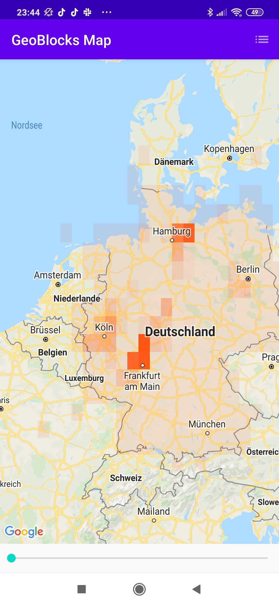

# GeoBlocksExample
A quick and fun app to display distribution maps on Google Maps :smiley:

Idea
---
This app is a quick demonstration of how Google Map Polygons can be used to create on the fly distribution maps, with help of **GeoBlocks**. GeoBlocks are rectangular geo-locations which represent a section of the world map. This is done by giving unique ids to each square of the map, determined by a provided **latitude gap** and **longitude gap**. The larger the gaps, the larger the *GeoBlock* representation will be.

Example Use Case
---
By collecting geo-data and timestamp data from a specific bird species present in Germany, I created a slider and displayed the distribution by GeoBlocks for this species dependent on the week of the year. The slider starts at week 1 and ends at week 52.

| Week          | Screenshot      |
| ------------- |:-------------:|
| col 3 is      | 

|
| col 2 is      | centered      | 
| zebra stripes | are neat      | 

