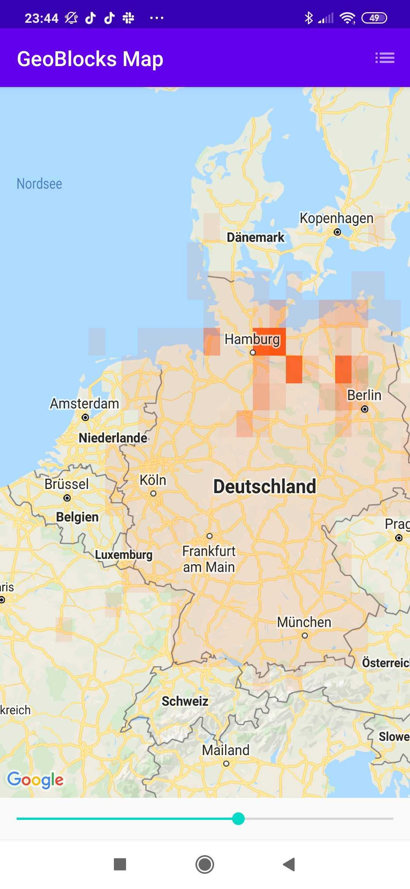
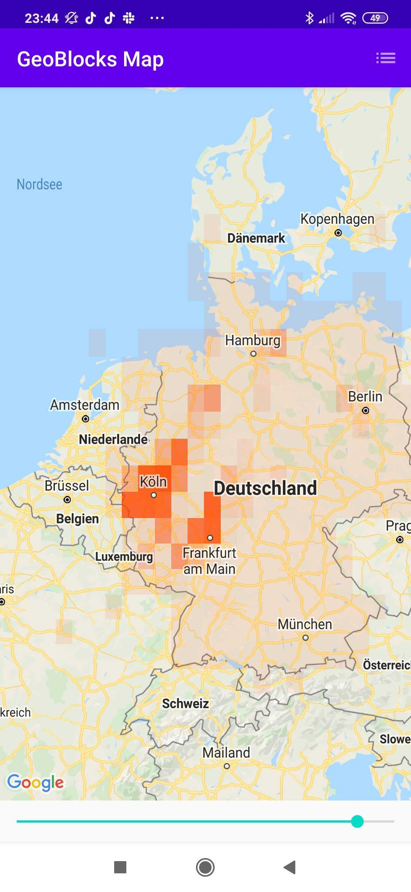

# GeoBlocksExample
A quick and fun app to display distribution maps on Google Maps :smiley:

Idea
---
This app is a quick demonstration of how Google Map Polygons can be used to create on the fly distribution maps, with help of **GeoBlocks**. GeoBlocks are rectangular geo-locations which represent a section of the world map. This is done by giving unique ids to each square of the map, determined by a provided **latitude gap** and **longitude gap**. The larger the gaps, the larger the *GeoBlock* representation will be. Rather than pulling data from thousands of records, and plotting them with markers, you can pull GeoBlock data to get block count representations which hold the count of how many records exist in the current GeoBlock.

Example Use Case
---
By collecting geo-data and timestamp data from a specific bird species present in Germany, I created a slider and displayed the distribution by GeoBlocks for this species dependent on the week of the year. The slider starts at week 1 and ends at week 52.

| Week          | Screenshot      |
| ------------- |:-------------:|
| 1      |   |
| 31     |    | 
| 49     |    |

To Do
---
- [ ] Create a library to use the GeoBlocks
- [ ] Add block gaps and styling customization to library
